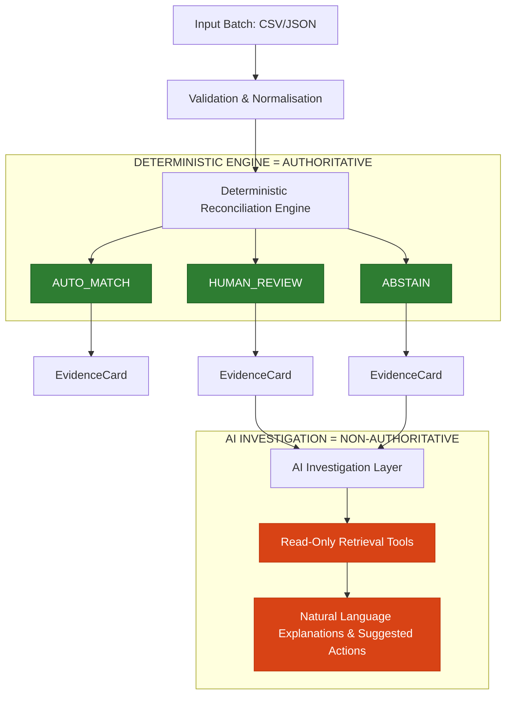

# LedgerLens System Architecture

This document details the high-level engineering architecture, core modules, data flow, and safety boundaries of **LedgerLens**, an evidence-first AI Finance Controller.

---

## 1. The Core Problem
Financial reconciliation is conventionally solved in one of two ways:
1. **Rigid Rule Engines:** Brittle, unable to resolve natural language discrepancy variance (e.g., payment description discrepancies, bank narration variations).
2. **Naive AI Agents:** Directing LLMs to make matching decisions. This introduces **hallucination risk**, exposes systems to API latency/downtime failures, and violates compliance requirements since AI predictions lack deterministic audit trails.

---

## 2. The LedgerLens Solution
LedgerLens places **AI strictly behind a deterministic boundary**. Deterministic algorithms are the sole authoritative deciders of matches and exception routing. The AI is restricted to a **post-reconciliation advisory role**, performing descriptive analysis on exceptions using sandboxed, read-only tools.

---

## 3. Data Model & Normalisation Flow
All ingested multi-source files are validated and normalized into canonical domain models before processing:
- **Canonical Payment:** Source payment records (representing internal order ledgers).
- **Canonical Settlement:** Gateway settlement payout groupings, fees, and service taxes.
- **Canonical Bank Entry:** Statement lines representing physical cash clearings in the bank account.
- **Canonical Ledger Entry:** Accounting general ledger records tracking financial credits/debits.

Each source is strictly parsed via Pydantic schemas, ensuring timezone offsets, float decimals (using standard Python `Decimal`), and null constraints are validated before matching begins.

---

## 4. Deterministic Reconciliation Layer
The engine processes the normalized data through two matching pipelines:
1. **Exact Matching:** Employs precise identifier correlations (e.g., matching unique gateway `payment_id` fields, exact amounts, and dates).
2. **Composite Signal Matching:** Employs weighted composite scoring across timing windows and numeric values:
   - **CS001 (Amount Matching):** Verifies currency and computes exact gross-to-settlement balances.
   - **CS002 (Ref ID Similarity):** Checks token similarity (Levensthein distance) between payment IDs and statement narrations.
   - **CS003 (Gateway Fee Reconciliation):** Calculates whether gateway deductions equal gross minus net payouts.
   - **CS004 (Calendar Timing Decay):** Computes calendar day distance between `payment_date` and `settlement_date` using linear scoring decays based on defined policies.

---

## 5. EvidenceCard & Audit Trail
Every single match decision, review, or abstention is bundled into an immutable `EvidenceCard` containing:
- **Rules Triggered:** Exact list of validation and composite rules executed.
- **Confidence Score:** Derived mathematically from deterministic composite calculations (never arbitrary LLM outputs).
- **Matching Features:** Features compared (amounts, narration tokens, timestamp offsets).
- **Audit ID:** A UUID reference linking the decision to raw database states.

---

## 6. Exception Routing & Classification
When records violate matching invariants, they are assigned structured exception codes:
- `E001` (Missing Settlement): Payment is logged but no payout/settlement file was received.
- `E002` (Amount Mismatch): Payment net does not equal bank clearing value.
- `E003` (Duplicate Transaction): Double clearing observed in bank narrations.
- `E005` (Missing Bank Entry): Payment and settlement exist, but bank clearance is absent.
- `E006` (Settlement Fee Variance): Deducted gateway fees violate agreed pricing contracts.
- `E008` (Orphan Bank Entry): Bank clearance statement contains no matching internal records.

---

## 7. AI Authority Boundary & Sandboxing
The investigation service (`AgentInvestigationService`) handles the natural-language analysis of exception items under strict bounds:

### Non-Authoritative Rule
- **The AI never writes reconciliation decisions.**
- **The AI never changes matching confidence.**
- **The AI never changes exception codes.**
- **The AI never modifies database financial records.**

### Bounded Tool Retrieval
The agent retrieves context using sandboxed, read-only tools:
- `fetch_payment_evidence(payment_id)`: Fetches the deterministic `EvidenceCard`.
- `fetch_policy_rules(rule_id)`: Fetches target business rules (e.g. V001–V004).
- `list_batch_orphans()`: Fetches unallocated bank narrations.

---

## 8. Failure & Fallback Path Design
1. **Gemini Client Failure:** If the API times out, returns an invalid schema, or fails due to network downtime, the system catches the exception and returns a structured fallback report with status `UNAVAILABLE`, preserving the deterministic match results.
2. **API Sanitization Boundary:** Any unhandled 500 exception in the FastAPI web server is intercepted at the middleware layer. System tracebacks, database queries, and class names are logged server-side, returning a sanitized `{"detail": "Internal reconciliation failure."}` to the operator client.
