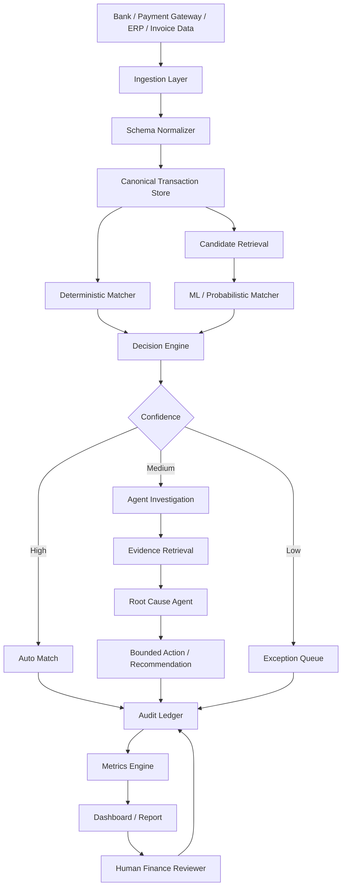
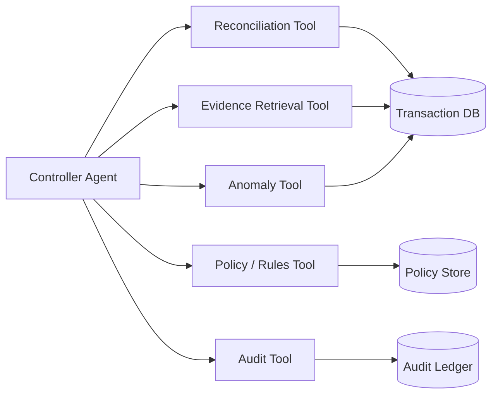
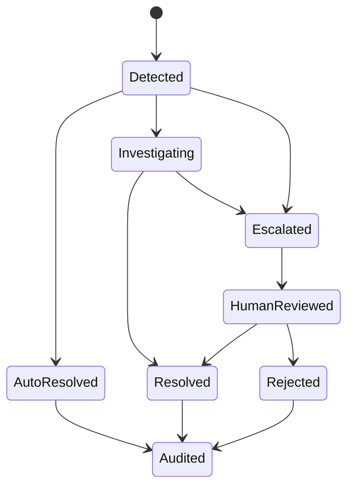

# 🧠 Razorpay AI Buildathon 2026 — Track 04
# AI Finance Controller

> **Mission:** Run the books and the cash position.
>
> Build an agent that closes **one finance-ops loop** across a **50+ record synthetic-data batch**, reporting:
> - match rate
> - measured accuracy
> - throughput
> - unresolved exceptions
> - evidence / audit trail
> - graceful handling of failure

---

## 📌 Table of Contents

- [1. How We Got Here](#1-how-we-got-here)
- [2. Track Selection](#2-track-selection)
- [3. The Exact Problem](#3-the-exact-problem)
- [4. What the Track Is Really Testing](#4-what-the-track-is-really-testing)
- [5. The Core Design Direction](#5-the-core-design-direction)
- [6. Senior System-Design View](#6-senior-system-design-view)
- [7. Proposed Architecture](#7-proposed-architecture)
- [8. Reconciliation Intelligence](#8-reconciliation-intelligence)
- [9. Agent Design](#9-agent-design)
- [10. Evidence, Provenance & Auditability](#10-evidence-provenance--auditability)
- [11. Exception Handling](#11-exception-handling)
- [12. Dataset & Evaluation](#12-dataset--evaluation)
- [13. What Makes It Different](#13-what-makes-it-different)
- [14. Research & Proven Ideas](#14-research--proven-ideas)
- [15. Learning Roadmap](#15-learning-roadmap)
- [16. Videos / Tutorials](#16-videos--tutorials)
- [17. Tools & Technology Candidates](#17-tools--technology-candidates)
- [18. Razorpay Integration References](#18-razorpay-integration-references)
- [19. Build Plan](#19-build-plan)
- [20. Demo Strategy](#20-demo-strategy)
- [21. Judge-Facing Metrics](#21-judge-facing-metrics)
- [22. Failure Cases We Must Demonstrate](#22-failure-cases-we-must-demonstrate)
- [23. GitHub Repository Structure](#23-github-repository-structure)
- [24. Definition of Done](#24-definition-of-done)
- [25. Links & Research Library](#25-links--research-library)
- [26. Final Winning Principle](#26-final-winning-principle)

---

# 1. How We Got Here

We started by reviewing the Razorpay AI Buildathon tracks and comparing the nature of the problems.

The four tracks reviewed were:

| Track | Name | Core objective |
|---|---|---|
| 01 | AI Growth & Agentic Commerce | Increase merchant revenue / make merchants transact with AI buyers |
| 02 | AI Risk Manager | Reduce fraud, returns and chargeback losses |
| 03 | AI Revenue Recovery | Detect revenue leakage and execute bounded recovery |
| **04** | **AI Finance Controller** | **Automate a finance-operations loop such as reconciliation, settlement or forecasting** |

The decision was to focus on **Track 04 — AI Finance Controller**.

The official Buildathon page describes the track as:

> Build an agent that closes one finance-ops loop across a 50+ record batch of synthetic data, reporting its match rate and the exceptions it could not resolve.

The official page also lists:

- Multi-source reconciliation
- Settlement Q&A agent
- Forward cash forecaster
- Tax-line matcher

The stated bar is:

> **Throughput + measured accuracy + an honest exception list.**

That sentence is extremely important.

This is **not** primarily an LLM chatbot competition.

It is an **evaluation + automation + financial correctness + system-design** problem.

---

# 2. Track Selection

## Why Track 04 is strategically interesting

The track naturally combines:

- AI / ML
- agentic workflows
- structured data
- financial operations
- deterministic business rules
- anomaly detection
- retrieval
- explainability
- auditability
- measurable evaluation
- system design

That combination gives us an opportunity to build something much deeper than:

```text
CSV → LLM → answer
```

Instead, the target is:

```text
Financial records
      ↓
Normalize
      ↓
Match
      ↓
Verify
      ↓
Investigate
      ↓
Decide
      ↓
Evidence
      ↓
Exception / resolution
      ↓
Metrics
```

The important mindset shift:

> **The LLM should not be the accountant. The system should be the accountant, with the LLM acting as a bounded reasoning/interface layer.**

---

# 3. The Exact Problem

## Official Track 04 framing

### AI Finance Controller

**Run the books and the cash position.**

Build an agent that closes one finance-ops loop across a **50+ record batch of synthetic data**, reporting:

- match rate
- unresolved exceptions
- throughput
- measured accuracy

### Why now?

The track says verification capacity—not generation speed—is the bottleneck.

Finance operations such as:

- reconciliation
- settlement
- forecasting

still contain substantial manual work.

### Example directions

1. Multi-source reconciliation
2. Settlement Q&A agent
3. Forward cash forecaster
4. Tax-line matcher

---

# 4. What the Track Is Really Testing

A weak implementation:

```text
Upload CSV
  ↓
Ask GPT to compare rows
  ↓
"Everything looks correct"
```

This is not enough.

A stronger implementation:

```text
Source A ─────┐
              ├──> Canonical transaction model
Source B ─────┤
              │
Source C ─────┘
                     ↓
             Candidate generation
                     ↓
             Deterministic matching
                     ↓
             Probabilistic scoring
                     ↓
              Evidence retrieval
                     ↓
             Root-cause analysis
                     ↓
       ┌─────────────┴──────────────┐
       ↓                            ↓
   Auto-resolve                 Exception
       ↓                            ↓
   Audit record             Human review queue
```

The system should be able to say:

> **Matched because transaction ID, amount, currency and date-window evidence agree.**

And:

> **Could not resolve because two candidate records have equal confidence and the settlement reference conflicts.**

That is much more credible than a generated explanation.

---

# 5. The Core Design Direction

## Working product concept

### **LedgerLens — Agentic Finance Reconciliation Controller**

> An evidence-first finance operations agent that reconciles multi-source transaction records, diagnoses mismatches, produces auditable decisions, and explicitly escalates uncertain cases.

The name is provisional. The product identity can be changed later.

---

## The key idea

Do **not** build an "LLM reconciliation bot".

Build an:

# **Evidence-First Reconciliation Operating System**

The system has three levels of intelligence:

### Level 1 — Deterministic

Use:

- exact IDs
- amount equality
- currency
- date windows
- reference numbers
- status compatibility
- known business rules

### Level 2 — Statistical / ML

Use:

- fuzzy matching
- anomaly scoring
- probabilistic record linkage
- historical matching patterns
- confidence calibration

### Level 3 — Agentic reasoning

Use an LLM only when structured logic cannot finish the job:

- inspect related records
- retrieve evidence
- explain root cause
- recommend next action
- generate exception narrative
- answer finance questions

This gives us a hybrid architecture instead of an LLM wrapper.

---

# 6. Senior System-Design View

## Design principles

### 1. Determinism before generation

Financial arithmetic and matching rules should not depend on an LLM.

### 2. Evidence before explanation

The agent must retrieve evidence before generating a conclusion.

### 3. Confidence before action

Every automated decision gets a confidence score.

### 4. Abstention is a feature

If the system is uncertain:

```text
DO NOT GUESS
      ↓
CREATE EXCEPTION
      ↓
SHOW EVIDENCE
      ↓
REQUEST REVIEW
```

### 5. Every decision is reproducible

Given the same data and configuration, the system should reproduce the same decision.

### 6. Measure the entire batch

Do not show one perfect example.

Show:

```text
100 records
↓
74 exact matches
11 probabilistic matches
9 anomalies
6 unresolved
```

### 7. Audit trail is first-class data

Every decision should produce:

- input records
- candidate records
- rules triggered
- model score
- evidence
- decision
- timestamp
- agent/tool calls
- final status

---

# 7. Proposed Architecture



---

# 8. Reconciliation Intelligence

## 8.1 Canonical transaction model

Normalize every source into one internal representation.

Example:

```json
{
  "transaction_id": "TXN_10482",
  "source": "razorpay",
  "merchant_id": "M_019",
  "order_id": "ORD_4421",
  "payment_id": "pay_abc",
  "amount": 1499.00,
  "currency": "INR",
  "transaction_date": "2026-08-20",
  "settlement_date": "2026-08-21",
  "status": "captured",
  "reference": "REF_99382"
}
```

Different source schemas should map into this model.

---

## 8.2 Matching cascade

Instead of one giant AI model:

### Stage A — Exact matching

Examples:

```text
transaction_id exact
payment_id exact
order_id exact
reference exact
```

### Stage B — Strong composite matching

```text
merchant_id
+ amount
+ currency
+ date window
```

### Stage C — Fuzzy / probabilistic matching

Use features such as:

```text
amount similarity
date distance
reference similarity
merchant similarity
description similarity
currency agreement
status compatibility
```

### Stage D — Structural retrieval

Retrieve related records through transaction relationships.

Example:

```text
Invoice
  ↓
Order
  ↓
Payment
  ↓
Settlement
  ↓
Bank statement
```

### Stage E — Agent investigation

Only unresolved cases reach the LLM agent.

This is a major design principle.

---

# 9. Agent Design

## Proposed multi-agent / tool-based workflow

A single "super agent" is unnecessary.

Use specialized bounded roles.



### Controller Agent

Responsible for orchestration.

It should:

1. inspect case
2. call tools
3. collect evidence
4. determine whether the case is resolvable
5. produce structured output
6. abstain when confidence is insufficient

---

## Tool contracts

The agent should not directly manipulate arbitrary database state.

Example:

```text
find_candidates(transaction_id)
get_related_records(transaction_id)
calculate_match_score(candidate_a, candidate_b)
get_policy(rule_id)
create_exception(case)
record_audit_event(event)
```

This is safer and easier to evaluate.

---

# 10. Evidence, Provenance & Auditability

This is one of the strongest opportunities to differentiate.

For every decision, produce an **Evidence Card**.

Example:

```text
CASE: TXN_10482

Decision:
MATCHED

Confidence:
0.97

Evidence:
✓ Payment ID matched
✓ Order ID matched
✓ Amount matched: ₹1,499
✓ Currency matched: INR
✓ Transaction date within allowed window
✓ Settlement record found

Rules:
R001 exact payment ID
R004 amount + date consistency

Agent reasoning:
Not required.

Audit ID:
AUD_20260821_10482
```

For an unresolved case:

```text
CASE: TXN_10901

Decision:
UNRESOLVED

Confidence:
0.41

Possible candidates:
CAND_1 → 0.43
CAND_2 → 0.41

Conflict:
Amount agrees with CAND_1.
Settlement reference agrees with CAND_2.

Action:
ESCALATE TO HUMAN REVIEW

Reason:
No deterministic tie-breaker exists.
```

This is much stronger than pretending the AI knows the answer.

---

# 11. Exception Handling

## Exception taxonomy

Create explicit categories.

Examples:

| Code | Exception |
|---|---|
| E001 | Missing source record |
| E002 | Amount mismatch |
| E003 | Duplicate transaction |
| E004 | Date-window violation |
| E005 | Currency mismatch |
| E006 | Conflicting references |
| E007 | Multiple candidates |
| E008 | Unknown transaction |
| E009 | Settlement mismatch |
| E010 | Insufficient evidence |

The agent should classify exceptions rather than simply saying "mismatch".

---

## Exception lifecycle



---

# 12. Dataset & Evaluation

## Minimum requirement

The track explicitly asks for a **50+ record synthetic batch**.

Do not stop at 50.

A better demo dataset:

```text
250–1,000 records
```

with controlled ground truth.

---

## Synthetic-data generator

Create realistic records and inject known problems.

### Clean cases

- exact match
- date shift
- normal settlement delay
- normal status transitions

### Injected discrepancies

- amount mismatch
- missing settlement
- duplicate
- wrong reference
- date mismatch
- partial payment
- currency issue
- orphan record
- conflicting candidate
- delayed settlement
- duplicate webhook/event

Because we control the ground truth, we can calculate honest metrics.

---

## Evaluation metrics

### Match rate

```text
matched_records / total_records
```

### Precision

```text
correct_auto_matches / all_auto_matches
```

### Recall

```text
correct_matches / all_true_matches
```

### Exception rate

```text
unresolved_records / total_records
```

### False auto-match rate

Critical metric:

```text
wrongly_auto_resolved / all_auto_resolved
```

### Coverage

```text
records_completed_without_human_review / total_records
```

### Throughput

```text
records_processed / unit_time
```

### Evidence completeness

Percentage of decisions containing all required supporting evidence.

---

## Example final report

```text
BATCH: AUG-2026-DEMO-01

Records:                500
Auto matched:           401
Agent resolved:          54
Escalated:               45

Overall resolved:       455 / 500
Resolution rate:         91.0%

Auto-match precision:    98.2%
Candidate recall:        96.4%

False auto-match rate:    0.8%

Average processing time: 1.7 sec/record

Exceptions:
E002 Amount mismatch      17
E003 Duplicate             8
E007 Multiple candidates  11
E009 Settlement mismatch   6
E001 Missing record        3

Audit coverage:          100%
```

Numbers above are **illustrative only**. They must never be presented as real results until measured from our implementation.

---

# 13. What Makes It Different

The competitive danger is building something that looks like:

> "Upload CSV → AI reconciles it."

Many teams can do that.

Our differentiators should be architectural.

## Differentiator 1 — Evidence-first AI

The agent cannot invent an explanation without linked records.

---

## Differentiator 2 — Hybrid intelligence

```text
Rules
+
Statistical matching
+
ML anomaly detection
+
Agentic reasoning
```

rather than:

```text
LLM only
```

---

## Differentiator 3 — Abstention

The system earns trust by knowing when **not** to decide.

---

## Differentiator 4 — Reconciliation graph

Represent financial relationships as a graph:

```text
Merchant
   |
Order
   |
Payment
   |
Settlement
   |
Bank Entry
   |
Ledger Entry
```

This allows structural evidence retrieval.

---

## Differentiator 5 — Counterfactual explanation

For difficult cases, show:

```text
Why matched?
Why candidate A?
Why not candidate B?
What evidence would change the decision?
```

This is much closer to finance-ops reasoning.

---

## Differentiator 6 — Replayable audit

A reviewer should be able to click:

```text
Decision
 ↓
Evidence
 ↓
Rules
 ↓
Model score
 ↓
Agent/tool calls
 ↓
Final outcome
```

---

## Differentiator 7 — Benchmark mode

The GitHub repo should contain:

```text
Run benchmark
      ↓
Process hidden-style test cases
      ↓
Generate metrics
      ↓
Compare versions
```

This makes the project look like a serious engineering system rather than a demo.

---

# 14. Research & Proven Ideas

## 14.1 FinBalance — 2026

**FinBalance: A Multi-Document Accounting Reconciliation Benchmark**

This is highly relevant.

The benchmark studies accounting reconciliation from source documents through journal entries and balance-sheet consistency.

One important takeaway is that LLMs can produce numerically plausible outputs while still failing to bind outputs to supporting documents and maintain consistency.

**Design lesson for us:**

> Never evaluate only the final number. Evaluate whether the answer is supported by the correct underlying records.

Link:

https://arxiv.org/abs/2606.15949

---

## 14.2 FinRCA-Bench — 2026

**FinRCA-Bench: Benchmarking Evidence Retrieval and Reasoning for Financial AI Systems**

This is extremely relevant to the proposed architecture.

It studies financial reconciliation cases where evidence is distributed across invoices, purchase orders, approvals, allocations, payments, ledger entries and bank activity.

The paper separates:

```text
retrieval quality
from
reasoning quality
```

That strongly supports our architecture.

**Design lesson:**

> A correct root-cause label is not enough. The system must return the right evidence.

Link:

https://arxiv.org/abs/2608.18534

---

## 14.3 Machine learning for financial reconciliation — 2026

A 2026 framework discusses supervised, unsupervised and semi-supervised ML for large-scale financial reconciliation, including anomaly detection, feature engineering, class imbalance and explainability.

**Design lesson:**

Use ML for discrepancy detection rather than forcing an LLM to do every task.

Link:

https://www.researchgate.net/publication/407092252_Leveraging_Machine_Learning_for_Anomaly_Detection_in_Enterprise_Financial_Reconciliation_A_Framework_for_Large-Scale_Discrepancy_Resolution

---

## 14.4 Payment-system anomaly detection

Research on payment systems uses a layered architecture:

```text
supervised screening
        ↓
unsupervised anomaly detection
```

This is useful inspiration for a finance controller.

**Design lesson:**

Do not send every transaction to an expensive model. Narrow the search space first.

Link:

https://www.sciencedirect.com/science/article/pii/S2405918825000157

BIS version:

https://www.bis.org/publ/work1188.htm

---

## 14.5 AI + RPA reconciliation — 2025

Research on multi-agency payment reconciliation discusses combining:

- AI
- OCR
- NLP
- probabilistic matching
- anomaly detection
- RPA

for enterprise reconciliation workflows.

**Design lesson:**

The strongest systems combine AI with deterministic workflow automation.

Link:

https://ijamjournal.org/ijam/publication/index.php/ijam/article/view/944

---

## 14.6 AI-driven reconciliation agents — 2025

A 2025 review discusses AI-driven reconciliation, anomaly detection, explainability, compliance and cloud-native financial pipelines.

Link:

https://irjaeh.com/index.php/journal/article/view/1043?articlesBySimilarityPage=76

---

## 14.7 Finance-agent benchmark — 2025

The Finance Agent Benchmark evaluates LLM agents on difficult finance research tasks and shows that high-stakes finance agents still have significant reliability limitations.

**Design lesson:**

Do not treat an LLM's confident answer as ground truth.

Link:

https://arxiv.org/abs/2508.00828

---

## 14.8 LLM consistency in finance — 2025

Research on LLM consistency across finance/accounting tasks found task-dependent variability and showed that repeated runs / aggregation can improve consistency.

**Design lesson:**

For critical reasoning, use structured validation rather than trusting one generated response.

Link:

https://arxiv.org/abs/2503.16974

---

# 15. Learning Roadmap

## Phase 1 — Finance fundamentals

Learn:

- double-entry accounting basics
- ledger
- journal entry
- bank reconciliation
- payment settlement
- invoice
- receivable
- payable
- clearing
- reconciliation
- exception handling

Goal:

> Understand what a finance operator actually does before building the agent.

---

## Phase 2 — Data reconciliation

Learn:

- joins
- entity resolution
- fuzzy matching
- record linkage
- date windows
- tolerance matching
- duplicate detection
- missing-record detection

Practice:

```text
CSV A
CSV B
CSV C
```

and reconcile them.

---

## Phase 3 — ML matching

Learn:

- logistic regression
- gradient boosting
- classification
- anomaly detection
- similarity scoring
- probability calibration

Important:

> A simple, explainable model can be more useful than a complicated neural network.

---

## Phase 4 — Agent engineering

Learn:

- tool calling
- structured outputs
- state machines
- workflow orchestration
- retries
- guardrails
- observability
- evaluation

The agent should operate inside explicit boundaries.

---

## Phase 5 — Retrieval

Learn:

- SQL retrieval
- relational joins
- graph traversal
- hybrid retrieval
- evidence ranking

For this problem, relational/graph retrieval can be more useful than generic vector search.

---

## Phase 6 — Evaluation

Learn:

- precision
- recall
- F1
- false-positive cost
- calibration
- benchmark design
- test-set isolation
- regression testing

This is one of the most important phases.

---

# 16. Videos / Tutorials

## Automated Bank Reconciliation — 2025

**Automated Bank Reconciliation — How I created an AI-powered app**

Useful for understanding the end-to-end reconciliation UX and workflow.

https://www.youtube.com/watch?v=4zED_mHUJPE

Topics shown include:

- diagnosis
- cross-referencing
- statements
- ledgers
- balance sheets
- reporting
- AI-assisted reconciliation

---

## GST Reconciliation with AI — 2026

**AI Karega GST Reconciliation | No Paid Software Needed**

Useful for seeing how current accounting users are approaching AI-assisted reconciliation.

https://www.youtube.com/watch?v=Xzlj7xUxww0

Important:

> Treat this as workflow inspiration, not as the technical architecture we should copy.

---

# 17. Tools & Technology Candidates

The final stack should be selected based on implementation speed, reliability and demo quality.

## Backend

Potential:

- Python
- FastAPI

## Data

Potential:

- PostgreSQL
- DuckDB
- Pandas / Polars

DuckDB is particularly useful for fast analytical work over CSV/Parquet data.

Docs:

https://duckdb.org/docs/

---

## ML

Potential:

- scikit-learn
- XGBoost / LightGBM
- sentence-transformers where semantic similarity is actually useful

---

## Agent layer

Potential:

- LangGraph
- PydanticAI
- direct structured tool-calling

Important principle:

> Do not use an agent framework just because it is fashionable. Use one if it improves state management, observability or reliability.

---

## Frontend

Potential:

- React
- Tailwind CSS
- Recharts / lightweight charting

Dashboard should show:

```text
Batch status
Match rate
Accuracy
Exceptions
Confidence distribution
Processing time
Audit trail
```

---

## Observability

Potential:

- OpenTelemetry
- structured JSON logs
- LangSmith / equivalent tracing if useful
- custom audit event store

---

# 18. Razorpay Integration References

The Buildathon explicitly references Razorpay test-mode APIs.

## Official Buildathon

https://razorpay.com/buildathon/

The official page states that this is a student-only program and that applicants are expected to:

1. pick a track
2. build something real
3. show a public repository
4. provide a 5-minute pitch video
5. provide the architecture

It also states:

- ₹75,000 monthly stipend
- 6 or 12 months
- in-person in Bangalore
- no aptitude test
- no group discussion

---

## Razorpay Payments Quickstart

https://razorpay.com/docs/payments/quickstart/

Useful for:

- Test Mode
- API keys
- product selection
- webhooks

---

## Razorpay Test vs Live

https://razorpay.com/docs/payments/dashboard/test-live-modes/

Important:

> Test Mode is a sandbox and does not use real money.

---

## Razorpay Webhooks

https://razorpay.com/docs/webhooks/

Webhooks are important if we simulate event-driven finance operations.

They can provide events for:

- orders
- payments
- settlements
- disputes
- other Razorpay workflows

---

## Validate & Test Webhooks

https://razorpay.com/docs/webhooks/validate-test/

Important engineering details include:

- webhook signature validation
- duplicate-event handling
- event IDs
- event ordering
- test-mode validation

This maps nicely to the reliability layer of our system.

---

## Payment Webhook Setup

https://razorpay.com/docs/webhooks/setup-edit-payments/

---

## Razorpay API Reference

https://d6xcmfyh68wv8.cloudfront.net/docs/api/

---

## Razorpay Postman API Workspace

https://www.postman.com/razorpaydev/razorpay-public-workspace/documentation/mfu7vaw/razorpay-apis

---

# 19. Build Plan

## Sprint 0 — Understand

- [ ] Read official Track 04 specification
- [ ] Learn reconciliation terminology
- [ ] Read FinBalance
- [ ] Read FinRCA-Bench
- [ ] Study one practical reconciliation demo
- [ ] Define exact finance-ops loop

---

## Sprint 1 — Baseline

Build:

```text
CSV ingestion
↓
normalization
↓
exact matching
↓
basic exception list
```

No LLM yet.

Goal:

> Establish a trustworthy deterministic baseline.

---

## Sprint 2 — Intelligent matching

Add:

- fuzzy matching
- candidate generation
- probabilistic scoring
- anomaly detection

Benchmark against the baseline.

---

## Sprint 3 — Evidence layer

Add:

- transaction graph
- related-record retrieval
- evidence cards
- provenance
- audit ledger

---

## Sprint 4 — Agent

Add:

- controller agent
- investigation tools
- root-cause classification
- structured outputs
- abstention

---

## Sprint 5 — Dashboard

Build:

### Overview

```text
Records
Matched
Unresolved
Accuracy
Throughput
```

### Exceptions

```text
Exception ID
Severity
Reason
Evidence
Candidates
Recommended action
```

### Audit

```text
Case
Decision
Evidence
Rules
Model
Agent actions
Timestamp
```

---

## Sprint 6 — Benchmark

Generate several batches.

Example:

```text
Batch A: clean
Batch B: normal noise
Batch C: heavy discrepancies
Batch D: adversarial ambiguity
Batch E: unseen combinations
```

---

## Sprint 7 — Demo hardening

Test:

- malformed input
- duplicate records
- missing data
- conflicting candidates
- tool timeout
- LLM failure
- database failure
- repeated event
- unexpected schema

---

# 20. Demo Strategy

The demo should tell a story.

## Scene 1 — The finance problem

Show:

```text
500 transactions
4 source systems
multiple discrepancies
```

---

## Scene 2 — One clean match

Click a matched transaction.

Show evidence.

---

## Scene 3 — One hard case

Show a transaction with two plausible candidates.

The system should **not guess**.

Show:

```text
Candidate A: 0.52
Candidate B: 0.49

Conflict:
amount → A
reference → B

Decision:
ESCALATE
```

This is a strong trust moment.

---

## Scene 4 — Agent investigation

Let the agent retrieve:

```text
payment
order
settlement
ledger
```

and explain the discrepancy.

---

## Scene 5 — Batch result

Show the full evaluation.

```text
500 records

91% resolved
98% auto-match precision
9% exceptions
100% audit coverage
```

Again: use only real measured numbers.

---

# 21. Judge-Facing Metrics

The README / demo should make the following impossible to miss.

| Metric | Meaning |
|---|---|
| Total records | Size of evaluation batch |
| Auto-match rate | Records resolved deterministically/automatically |
| Precision | How many automated decisions were correct |
| Recall | How many true matches were recovered |
| Exception rate | How many cases remain unresolved |
| False auto-match rate | Dangerous incorrect automatic decisions |
| Throughput | Records processed per second/minute |
| Evidence coverage | Decisions with sufficient supporting evidence |
| Audit coverage | Decisions with replayable audit records |
| Human-review reduction | Work eliminated without unsafe automation |

---

# 22. Failure Cases We Must Demonstrate

A winning system should show controlled failure.

## Failure 1 — Ambiguous candidates

Expected:

```text
ABSTAIN
```

---

## Failure 2 — Missing source

Expected:

```text
E001 Missing source record
```

---

## Failure 3 — Duplicate

Expected:

```text
E003 Duplicate transaction
```

---

## Failure 4 — Amount mismatch

Expected:

```text
E002 Amount mismatch
```

---

## Failure 5 — LLM unavailable

Expected:

```text
Agent investigation unavailable.

Deterministic reconciliation continues.
Case moved to exception queue.
```

This proves the LLM is not a single point of failure.

---

## Failure 6 — Duplicate webhook

Expected:

```text
event_id already processed
→ ignore duplicate
→ preserve idempotency
```

---

# 23. GitHub Repository Structure

```text
ledgerlens/
│
├── README.md
│
├── docs/
│   ├── architecture.md
│   ├── problem.md
│   ├── research.md
│   ├── evaluation.md
│   ├── finance-glossary.md
│   └── demo-script.md
│
├── data/
│   ├── schemas/
│   ├── synthetic/
│   └── README.md
│
├── src/
│   ├── ingestion/
│   ├── normalization/
│   ├── matching/
│   ├── anomaly/
│   ├── retrieval/
│   ├── agents/
│   ├── audit/
│   ├── evaluation/
│   └── api/
│
├── frontend/
│
├── tests/
│   ├── unit/
│   ├── integration/
│   ├── benchmark/
│   └── failure_cases/
│
├── notebooks/
│
├── scripts/
│   ├── generate_dataset.py
│   ├── run_benchmark.py
│   └── generate_report.py
│
├── docker/
│
└── .github/
    └── workflows/
```

---

# 24. Definition of Done

## Product

- [ ] Real working dashboard
- [ ] Upload / ingest synthetic data
- [ ] Run reconciliation
- [ ] Show results
- [ ] Show exceptions
- [ ] Show evidence
- [ ] Show audit trail

## Engineering

- [ ] Deterministic baseline
- [ ] ML / probabilistic layer
- [ ] Agent investigation
- [ ] Tool contracts
- [ ] Idempotency
- [ ] Error handling
- [ ] Logging
- [ ] Tests

## Evaluation

- [ ] 50+ records
- [ ] Preferably 250+ records for demonstration
- [ ] Ground truth
- [ ] Held-out evaluation set
- [ ] Precision
- [ ] Recall
- [ ] False-positive / false-match analysis
- [ ] Throughput
- [ ] Exception list

## AI

- [ ] LLM has a meaningful role
- [ ] Agent has bounded tools
- [ ] Structured outputs
- [ ] Evidence-grounded responses
- [ ] Abstention
- [ ] Agent failure handling

## Demo

- [ ] 5-minute pitch
- [ ] Architecture diagram
- [ ] One clean match
- [ ] One difficult case
- [ ] One graceful failure
- [ ] Full-batch metrics
- [ ] Public GitHub repository

---

# 25. Links & Research Library

## 🏆 Official

- Razorpay AI Buildathon: https://razorpay.com/buildathon/

## 💳 Razorpay

- Payments Quickstart: https://razorpay.com/docs/payments/quickstart/
- Test vs Live Modes: https://razorpay.com/docs/payments/dashboard/test-live-modes/
- Webhooks: https://razorpay.com/docs/webhooks/
- Validate & Test Webhooks: https://razorpay.com/docs/webhooks/validate-test/
- Payment Webhook Setup: https://razorpay.com/docs/webhooks/setup-edit-payments/
- API Reference: https://d6xcmfyh68wv8.cloudfront.net/docs/api/
- Razorpay Postman Workspace: https://www.postman.com/razorpaydev/razorpay-public-workspace/documentation/mfu7vaw/razorpay-apis
- RazorpayX Test Mode reference: https://d6xcmfyh68wv8.cloudfront.net/docs/x/get-started/test-mode/

## 📄 Research

- FinBalance — Multi-Document Accounting Reconciliation Benchmark (2026): https://arxiv.org/abs/2606.15949
- FinRCA-Bench — Evidence Retrieval & Reasoning for Financial AI (2026): https://arxiv.org/abs/2608.18534
- ML for Enterprise Financial Reconciliation (2026): https://www.researchgate.net/publication/407092252_Leveraging_Machine_Learning_for_Anomaly_Detection_in_Enterprise_Financial_Reconciliation_A_Framework_for_Large-Scale_Discrepancy_Resolution
- ML anomaly detection in payment systems: https://www.sciencedirect.com/science/article/pii/S2405918825000157
- BIS payment-system anomaly detection: https://www.bis.org/publ/work1188.htm
- AI + RPA payment reconciliation (2025): https://ijamjournal.org/ijam/publication/index.php/ijam/article/view/944
- AI-driven reconciliation agents (2025): https://irjaeh.com/index.php/journal/article/view/1043?articlesBySimilarityPage=76
- Finance Agent Benchmark (2025): https://arxiv.org/abs/2508.00828
- LLM consistency in finance/accounting (2025): https://arxiv.org/abs/2503.16974
- Intelligent intercompany automation / financial settlements (2025): https://ijsra.net/node/1651
- Intelligent order matching & reconciliation (2026): https://www.researchgate.net/publication/407104022_Reducing_Financial_Losses_Through_Intelligent_Order_Matching_and_Reconciliation_Systems
- Structured financial reconciliation / anomaly detection (2026): https://papers.ssrn.com/sol3/papers.cfm?abstract_id=6289499

## 🎥 Videos

- Automated Bank Reconciliation — AI-powered app: https://www.youtube.com/watch?v=4zED_mHUJPE
- AI GST Reconciliation — 2026: https://www.youtube.com/watch?v=Xzlj7xUxww0

## 🗄️ Data / Analytics

- DuckDB documentation: https://duckdb.org/docs/

---

# 26. Final Winning Principle

The project should **not** be:

> "We built an AI that reconciles financial records."

It should be:

> **"We built an evidence-first finance controller that can reconcile a full batch, measure its own performance, explain every decision, and know when it should not decide."**

The architecture we are aiming for:

```text
                  ┌─────────────────────────┐
                  │   MULTI-SOURCE DATA     │
                  └────────────┬────────────┘
                               ↓
                  ┌─────────────────────────┐
                  │   NORMALIZATION         │
                  └────────────┬────────────┘
                               ↓
                  ┌─────────────────────────┐
                  │ DETERMINISTIC MATCHING  │
                  └────────────┬────────────┘
                               ↓
                  ┌─────────────────────────┐
                  │ ML / PROBABILISTIC      │
                  │ MATCHING + ANOMALIES    │
                  └────────────┬────────────┘
                               ↓
                  ┌─────────────────────────┐
                  │ EVIDENCE / GRAPH        │
                  │ RETRIEVAL               │
                  └────────────┬────────────┘
                               ↓
                  ┌─────────────────────────┐
                  │ BOUNDED FINANCE AGENT   │
                  └────────────┬────────────┘
                               ↓
              ┌────────────────┴────────────────┐
              ↓                                 ↓
       HIGH CONFIDENCE                    LOW CONFIDENCE
              ↓                                 ↓
        AUTO RESOLVE                       ABSTAIN
              ↓                                 ↓
              └──────────────┬──────────────────┘
                             ↓
                    ┌─────────────────┐
                    │ AUDIT LEDGER    │
                    └────────┬────────┘
                             ↓
                    ┌─────────────────┐
                    │ BATCH METRICS   │
                    └────────┬────────┘
                             ↓
                    ┌─────────────────┐
                    │ HUMAN + JUDGE   │
                    └─────────────────┘
```

## The three things we should optimize for

### 1. Correctness

Never invent financial facts.

### 2. Measurability

Never show cherry-picked success.

### 3. Trust

Never hide uncertainty.

---

## 🚀 Current north-star

**Build less chatbot. Build more finance infrastructure.**

If the judge can:

1. inspect a transaction,
2. see exactly why it matched,
3. inspect the evidence,
4. see the model / rule scores,
5. watch the agent investigate an exception,
6. see the agent abstain when appropriate,
7. inspect the complete audit trail,
8. and finally see measured results across hundreds of records,

then the project becomes much harder to dismiss as a generic GenAI demo.

---

> **Track 04 is a finance-ops engineering problem with AI inside it — not an AI demo with finance data attached.**